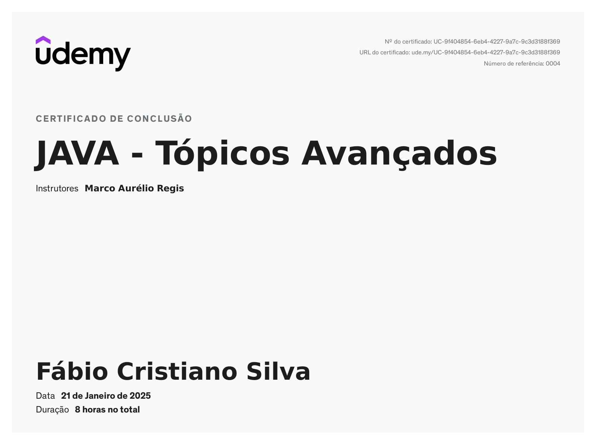
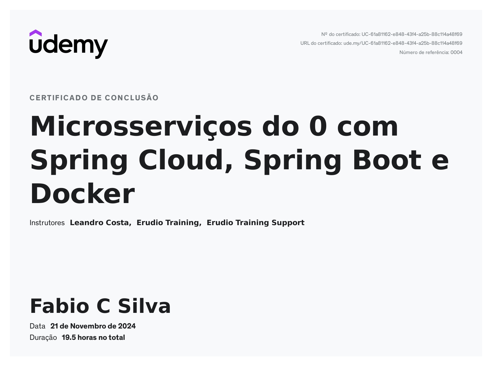
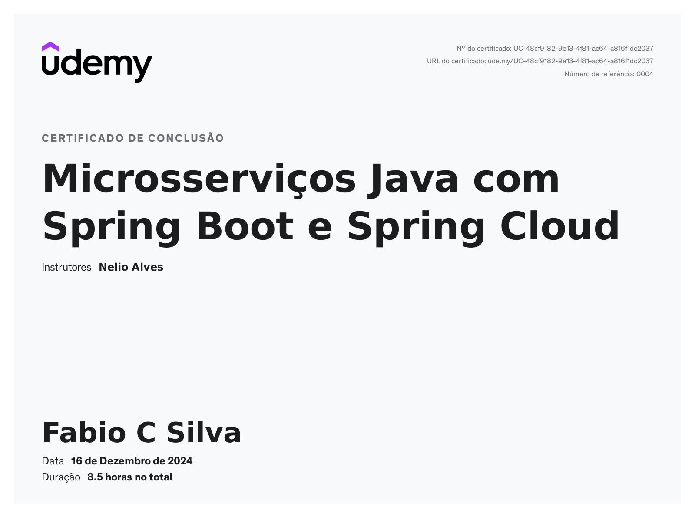
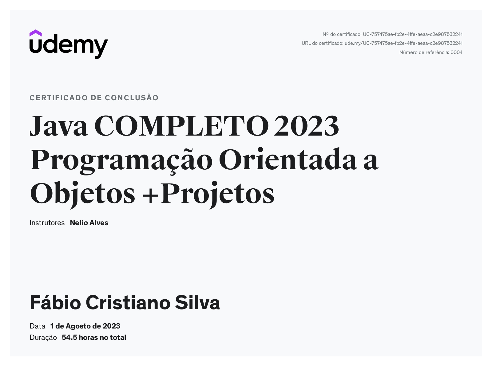
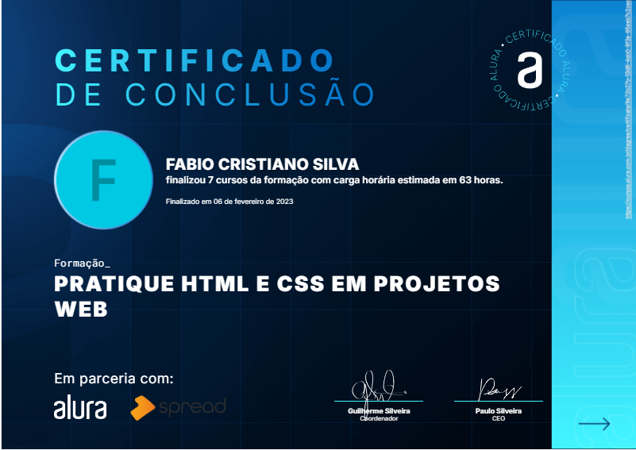
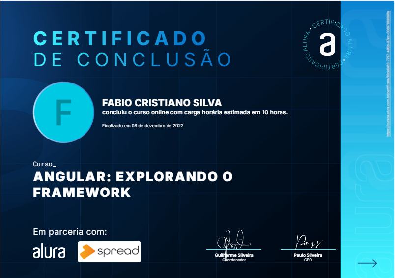
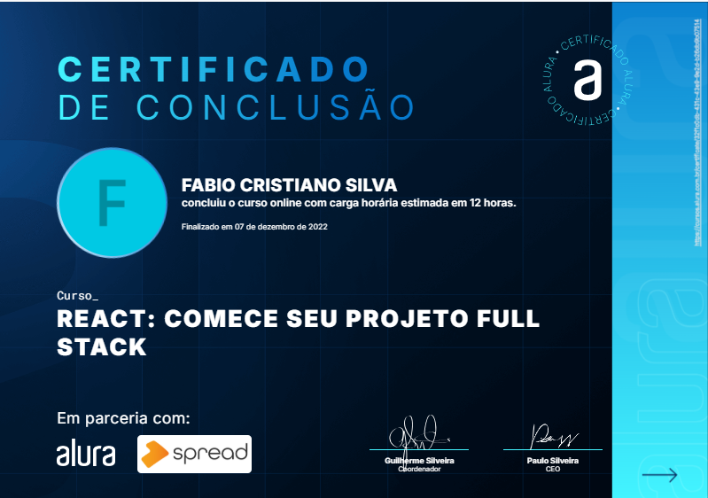

# 💻 Bem-vindo(a) ao meu GitHub

Olá! Eu sou **Fábio Cristiano Silva**, um desenvolvedor apaixonado por tecnologia e inovação. Aqui você encontrará projetos que demonstram minha experiência e aprendizado ao longo dos anos. Fique à vontade para explorar e contribuir! 🚀

---

## 🧑‍💻 Sobre Mim

- **Profissão:** Desenvolvedor Back-end Sênior  
- **Experiência:** 9+ anos com Java | Spring Boot | Hibernate | Arquitetura Hexagonal  
- **Paixão:** Resolver problemas complexos com elegância e eficiência  

---

## 🛠️ Tecnologias e Ferramentas

  
  
  
  
  
  
  
  

---

## 🌟 Projetos Destacados

### 📂 [Projeto 1: Nome do Projeto](https://github.com/seu-usuario/nome-do-projeto)
Descrição breve do projeto.

### 📂 [Projeto 2: Nome do Projeto](https://github.com/seu-usuario/nome-do-projeto)
Descrição breve do projeto.

---

## 🎓 Meus Certificados e Cursos 📚

### Cursos e Tecnologias Aprendidas

<table style="width: 100%; border-collapse: collapse;">
  <thead>
    <tr style="background-color: #f4f4f4; text-align: left;">
      <th style="padding: 10px; border: 1px solid #ddd;">Curso</th>
      <th style="padding: 10px; border: 1px solid #ddd;">Instituição</th>
      <th style="padding: 10px; border: 1px solid #ddd;">Ano</th>
      <th style="padding: 10px; border: 1px solid #ddd;">Certificado</th>
      <th style="padding: 10px; border: 1px solid #ddd;">Tecnologias Aprendidas</th>
    </tr>
  </thead>
  <tbody>
  <tr>
      <td style="padding: 10px; border: 1px solid #ddd;">Tópicos Avançados em JAVA 8 a 21</td>
      <td style="padding: 10px; border: 1px solid #ddd;">Udemy</td>
      <td style="padding: 10px; border: 1px solid #ddd;">2025</td>
      <td style="padding: 10px; border: 1px solid #ddd;"></td>
      <td style="padding: 10px; border: 1px solid #ddd;">JAVA 8 a 21.
      </td>
    </tr>
    <tr>
      <td style="padding: 10px; border: 1px solid #ddd;">Microsserviços com Spring Cloud, Spring Boot e Docker</td>
      <td style="padding: 10px; border: 1px solid #ddd;">Udemy</td>
      <td style="padding: 10px; border: 1px solid #ddd;">2024</td>
      <td style="padding: 10px; border: 1px solid #ddd;"></td>
      <td style="padding: 10px; border: 1px solid #ddd;">JAVA 17, Spring Boot 3, Docker, Resilience4j, Swagger, Eureka, Spring Cloud Configuration, Spring Boot Actuator, Spring Data JPA, Feign, Service Discovery e                 Registry com Eureka, Load Balancing com Eureka, Feign e Spring Cloud LoadBalancer, API Gateway e RouteLocator com Spring Cloud Gateway, Circuit Breaker com Resilience4j, Spring 
         Security,  OAuth e JWT, Configuraremos o Swagger OpenAPI nos microsserviços, Distributed Tracing com Docker, Zipkin, Eureka e Sleuth, Dockerização, entrega contínua com Github 
         Actions.
      </td>
    </tr>
    <tr>
      <td style="padding: 10px; border: 1px solid #ddd;">Microsserviços Java com Spring Cloud</td>
      <td style="padding: 10px; border: 1px solid #ddd;">Udemy</td>
      <td style="padding: 10px; border: 1px solid #ddd;">2024</td>
      <td style="padding: 10px; border: 1px solid #ddd;"></td>
      <td style="padding: 10px; border: 1px solid #ddd;">JAVA 21, Feign, Ribbon, Servidor Eureka, API Gateway Zuul, Hystrix, Spring Data JPA, Spring Security, OAuth e JWT, Servidor de 
          configuração centralizada com dados em repositório Git, Geração de containers Docker para os microsserviços e bases de dados.
      </td>
    </tr>
    <tr>
      <td style="padding: 10px; border: 1px solid #ddd;">Formação JAVA 9 Completo</td>
      <td style="padding: 10px; border: 1px solid #ddd;">Udemy</td>
      <td style="padding: 10px; border: 1px solid #ddd;">2023</td>
      <td style="padding: 10px; border: 1px solid #ddd;"></td>
      <td style="padding: 10px; border: 1px solid #ddd;">JAVA 9, PostgreSQL e Mysql, Maven, H2.</td>
    </tr>
    <tr>
      <td style="padding: 10px; border: 1px solid #ddd;">Formação JAVA 8 Completo</td>
      <td style="padding: 10px; border: 1px solid #ddd;">Udemy</td>
      <td style="padding: 10px; border: 1px solid #ddd;">2023</td>
      <td style="padding: 10px; border: 1px solid #ddd;"></td>
      <td style="padding: 10px; border: 1px solid #ddd;">JAVA 8, postgreSQL, Maven e H2.</td>
    </tr>
     <tr>
      <td style="padding: 10px; border: 1px solid #ddd;">Formação  HTML5 e CSS3 - 7 cursos</td>
      <td style="padding: 10px; border: 1px solid #ddd;">AluraUdemy</td>
      <td style="padding: 10px; border: 1px solid #ddd;">2023</td>
      <td style="padding: 10px; border: 1px solid #ddd;"></td>
      <td style="padding: 10px; border: 1px solid #ddd;">Vscode, FireFox, Figma.</td>
    </tr>
    <tr>
      <td style="padding: 10px; border: 1px solid #ddd;">Angular: 13 - Explorando o Framework</td>
      <td style="padding: 10px; border: 1px solid #ddd;">Alura</td>
      <td style="padding: 10px; border: 1px solid #ddd;">2022</td>
      <td style="padding: 10px; border: 1px solid #ddd;"></td>
      <td style="padding: 10px; border: 1px solid #ddd;">Angular, Formulários Reativos.</td>
    </tr>
    <tr>
      <td style="padding: 10px; border: 1px solid #ddd;">Consultas Avançadas em SQL</td>
      <td style="padding: 10px; border: 1px solid #ddd;">Alura</td>
      <td style="padding: 10px; border: 1px solid #ddd;">2022</td>
      <td style="padding: 10px; border: 1px solid #ddd;"></td>
      <td style="padding: 10px; border: 1px solid #ddd;">MYSQL.</td>
    </tr>
    <tr>
      <td style="padding: 10px; border: 1px solid #ddd;">Formação  Desenvolvedor Android - 10 cursos</td>
      <td style="padding: 10px; border: 1px solid #ddd;">Alura</td>
      <td style="padding: 10px; border: 1px solid #ddd;">2022</td>
      <td style="padding: 10px; border: 1px solid #ddd;"></td>
      <td style="padding: 10px; border: 1px solid #ddd;">Android studio, Java 6</td>
    </tr>
    <tr>
      <td style="padding: 10px; border: 1px solid #ddd;">Formação  React</td>
      <td style="padding: 10px; border: 1px solid #ddd;">Alura</td>
      <td style="padding: 10px; border: 1px solid #ddd;">2022</td>
      <td style="padding: 10px; border: 1px solid #ddd;"></td>
      <td style="padding: 10px; border: 1px solid #ddd;">VSCode, node, Java</td>
    </tr>
    <tr>
      <td style="padding: 10px; border: 1px solid #ddd;">Testes Automatizados de aceitação em JAVA</td>
      <td style="padding: 10px; border: 1px solid #ddd;">Alura</td>
      <td style="padding: 10px; border: 1px solid #ddd;">2022</td>
      <td style="padding: 10px; border: 1px solid #ddd;"></td>
      <td style="padding: 10px; border: 1px solid #ddd;">Selenium e Java</td>
    </tr>
    <tr>
      <td style="padding: 10px; border: 1px solid #ddd;">Formação COBOL</td>
      <td style="padding: 10px; border: 1px solid #ddd;">Udemy</td>
      <td style="padding: 10px; border: 1px solid #ddd;">2020</td>
      <td style="padding: 10px; border: 1px solid #ddd;"></td>
      <td style="padding: 10px; border: 1px solid #ddd;">OpenCobolIDE e RDZ</td>
    </tr>
  </tbody>
</table>

---

## 🌐 Redes Sociais

  

---

## 📈 Estatísticas do GitHub

  

---

## 📞 Contato

Se quiser bater um papo ou tiver interesse em trabalhar comigo, pode me encontrar em:

- 📧 **Email:** [fabiocristfile@gmail.com](mailto:fabiocristfile@gmail.com)  
- 💼 **LinkedIn:** [Fábio Cristiano Silva](https://www.linkedin.com/in/f%C3%A1bio-cristiano-silva-08b22ba9)  
